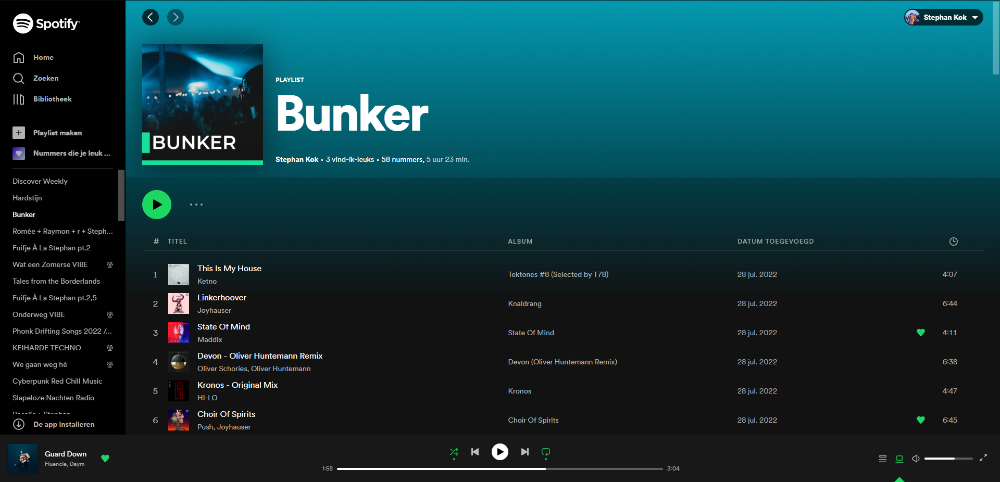
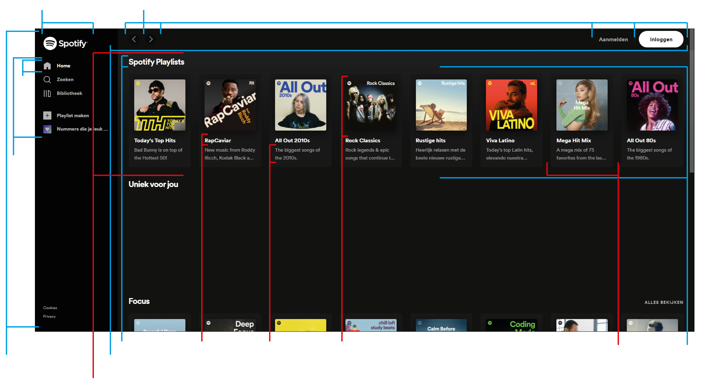
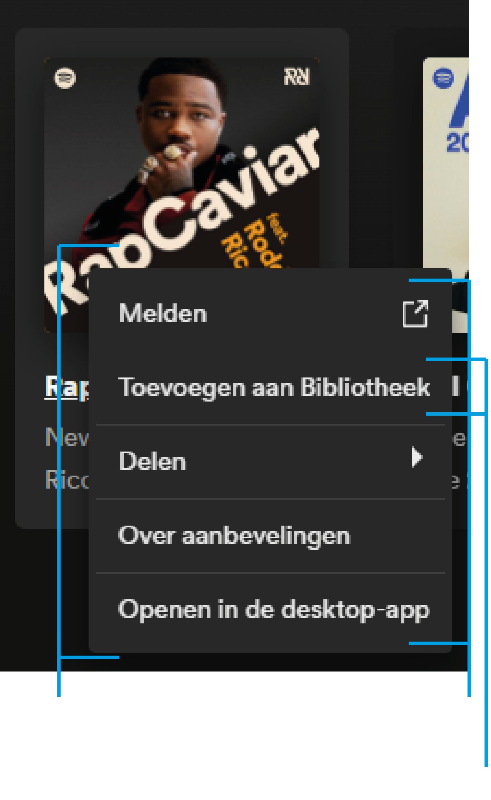

# Procesverslag
Markdown is een simpele manier om HTML te schrijven.  
Markdown cheat cheet: [Hulp bij het schrijven van Markdown](https://github.com/adam-p/markdown-here/wiki/Markdown-Cheatsheet).

Nb. De standaardstructuur en de spartaanse opmaak van de README.md zijn helemaal prima. Het gaat om de inhoud van je procesverslag. Besteedt de tijd voor pracht en praal aan je website.

Nb. Door *open* toe te voegen aan een *details* element kun je deze standaard open zetten. Fijn om dat steeds voor de relevante stuk(ken) te doen.

## Jij

  
uitwerken voor kick-off werkgroep

  ### Auteur:
  Stephan Kok

  #### Je startniveau:
  Rood

  #### Je focus:
  Surface Plane
 

## Je website

  
uitwerken voor kick-off werkgroep

  ### Je opdracht:
  https://open.spotify.com

  #### Screenshot(s) van de eerste pagina (small screen): 
  Spotify Web Homepage  
  

  #### Screenshot(s) van de tweede pagina (small screen):
  Spotify Web Playlist  
  
 

## Toegankelijkheidstest 1/2 (week 1)

  
uitwerken na test in 1e werkgroep

  ### Bevindingen
  Lijst met je bevindingen die in de test naar voren kwamen:

  #### Screenreader
  Bij het gebruik van een screenreader werd duidelijk dat het lastig is om snel te werken. Je moet eerst aanhoren wat er op de pagina is voordat je weet    wat er uberhaupt mogelijk is en waar je mee kunt interacten.

  Hier een omschrijving van hoe het opgelost kan worden (met indien nodig afbeeldingen)
  

  #### Muis en Toetsenbord 
  Hier korte omschrijving (met indien nodig afbeeldingen)

  Hier een omschrijving van hoe het opgelost kan worden (met indien nodig afbeeldingen)

  #### Motoriek (shocks, elastiekjes)
  Hier korte omschrijving (met indien nodig afbeeldingen)

  Hier een omschrijving van hoe het opgelost kan worden (met indien nodig afbeeldingen)

  #### Visueel (brillen, contrast, kleurenblind, dark/light). 
  Hier korte omschrijving (met indien nodig afbeeldingen)

  Hier een omschrijving van hoe het opgelost kan worden (met indien nodig afbeeldingen)

## Breakdownschets (week 1)

  
uitwerken na afloop 2e werkgroep

  ### de hele pagina: 
  

  ### dynamisch deel (Rechtermuisknop op playlist): 
  

## Voortgang 1 (week 2)

  
uitwerken voor 1e voortgang

  ### Stand van zaken

  
  Dit is hoe mijn pagina er op het moment uit ziet. Ik vond het in het begin lastig om het grid goed in elkaar te zetten. Ook had ik moeite met de header zelf. De uitlijning en de juiste afmetingen vinden ging namelijk niet heel makkelijk. Uiteindelijk ben ik dr wel uit gekomen en heb ik vrijwel alle elementen uit de homepage al af.

  ### Agenda voor meeting
  samen met je groepje opstellen

  | student 1      | student 2          | student 3    | student 4        |
  | ---            | ---                | ---          | ---              |
  | Hoe stellen jullie je css op  | en dit             | en ik dit    | en dan ik dat    |
  | Hoe erg is het dat ik nog geen main heb? | dit als er tijd is | nog een punt | dit wil ik zeker |
  | ...            | ...                | ...          | ...              |

  ### Verslag van meeting
  hier na afloop snel de uitkomsten van de meeting vastleggen

  - Css sorteer je op basis van html volgorde en categorie css elementen.
  - Een main is verplicht, nav en header mogen beiden daarintegen buiten de main staan.

## Voortgang 2 (week 3)

  
uitwerken voor 2e voortgang

  ### Stand van zaken
Ik ben deze week bezig geweest met het responsive maken van de website dmv breakpoints. Ook heb ik een begin gemaakt aan het hamburger menu. Deze is al bijna af en werkend op elk scherm. Op het moment loop ik een beetje te puzzelen met het responsive maken maar dit lukt steeds beter en ik kom stap voor stap langzaam vooruit. Hier en daar moet er wel nog wat aan de styling gedaan worden maar dit is makkelijk te doen.
Zo ziet het er nu uit.

Groot scherm:

Klein scherm:

  ### Agenda voor meeting
  samen met je groepje opstellen

  | student 1      | student 2          | student 3    | student 4        |
  | ---            | ---                | ---          | ---              |
  | Ik heb deze week geen punten om te bespreken.  | Ik had nog wat vragen over het hamburger menu.             | en ik dit    | en dan ik dat    |
  | en dat ook nog | dit als er tijd is | nog een punt | dit wil ik zeker |
  | ...            | ...                | ...          | ...              |

  ### Verslag van meeting
  hier na afloop snel de uitkomsten van de meeting vastleggen

  - Container queries bestuderen
  - Focus state verwerken

## Toegankelijkheidstest 2/2 (week 4)

  
uitwerken na test in 8e werkgroep

  ### Bevindingen
  Lijst met je bevindingen die in de test naar voren kwamen (geef ook aan wat er verbeterd is):
  - Links als h3 ipv a element
  - Maak gebruik van aria-labels
  - Layout veranderd bij het gebruik van tab
  - Tabben skipt sommige links in de nav menu.

  #### Screenreader
  De screenreader pakt alles goed op, alleen doordat sommige a elementen niet als a elementen in de html staan wordt niet goed opgepakt dat dit een interactief element is.

  Dit is te verbeteren door er gewoon een a element van te maken ipv een h3.

  #### Muis en Toetsenbord 
  Hier geldt eigenlijk hetzelfde als voor de screenreader. Ook moet ik de aria-labels goed gaan toepassen om een duidelijke beschrijving van elke link aan te geven.

  #### Motoriek (shocks, elastiekjes)
  Iedereen zou het kunnen gebruiken alleen zou het handig zijn om bijvoorbeeld dmv de pijltjes toetsen door de afspeellijsten te kunnen bladeren, nu moet je persé met de muis of touchpad scrollen.

  #### Visueel (brillen, contrast, kleurenblind, dark/light). 
  Bij het gebied van visuele beperkingen waren er eigenlijk geen negatieve punten. Je kan zowel met kleurenblindheid en blurred vision de site goed doorlopen.
  Een punt van verbetering was dat de langere zinnen of ingekort of vergroot moeten worden door een groter lettertype voor de mensen met Combined Loss.

## Voortgang 3 (week 4)

  
uitwerken voor 3e voortgang

  ### Stand van zaken
  Ik ben deze week veel blijven hangen omdat mijn motivatie mistte. Ik hoop dat deze week weer in te halen.

  ### Agenda voor meeting
  samen met je groepje opstellen

  | student 1      | student 2          | student 3    | student 4        |
  | ---            | ---                | ---          | ---              |
  | Deze week had ik geen punten om te bespreken.  | en dit             | en ik dit    | en dan ik dat    |
  | ... | dit als er tijd is | nog een punt | dit wil ik zeker |
  | ...            | ...                | ...          | ...              |

  ### Verslag van meeting
  hier na afloop snel de uitkomsten van de meeting vastleggen

  - Doorwerken!!

## Eindgesprek (week 5)

  
uitwerken voor eindgesprek

  ### Je uitkomst - karakteristiek screenshots:
  

  ### Dit ging goed/Heb ik geleerd: 
  Ik merkte dat wanneer ik aan de slag ging met de site en eenmaal bezig was ik gemakkelijk vooruitgang kon boeken. Dit was dan tijdens de lessen zelf. Ook had ik weinig moeite met de stof zelf, dit kwam denk ik vooral door mijn vorige opleiding.

  

  ### Dit was lastig/Is niet gelukt:
  Ik vond het lastig om thuis de motivatie te vinden om aan de opdracht te werken, hierdoor is het mij ook nog niet gelukt om een resultaat neer te zetten waar ik tevreden mee ben. (Of die af is)

  

## Bronnenlijst

  
continu bijhouden terwijl je werkt

  Nb. Wees specifiek ('css-tricks' als bron is bijv. niet specifiek genoeg).

  1. bron 1
  2. bron 2
  3. ...

